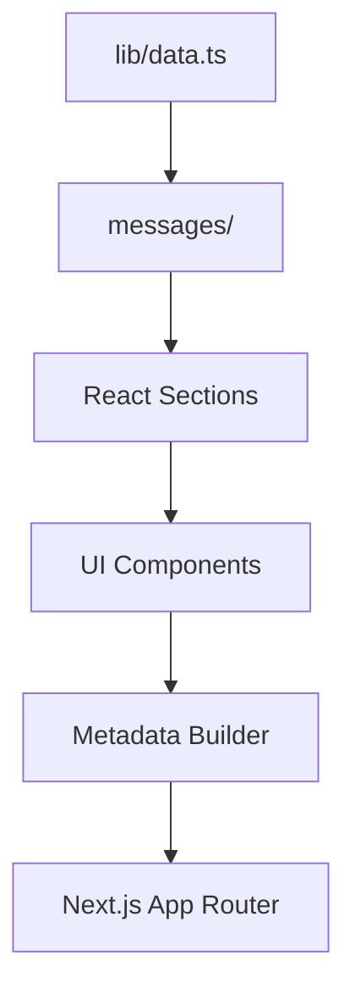

# Dervis Gómez — Portfolio


Portfolio personal de **Dervis Gómez**, Full Stack Developer con más de 9 años de experiencia construyendo productos web, aplicaciones móviles y plataformas empresariales para compañías en Latinoamérica.

Pensado como pieza técnica y profesional: presenta case studies reales, responsabilidades, impacto de negocio, stack y experiencia laboral de forma clara para reclutadores y desarrolladores.

**Producción:** [dervisgomez.dev](https://dervisgomez.dev) · **Rutas:** `/es` (español) · `/en` (inglés)

---

## Descripción del proyecto

Single-page application con **Next.js App Router** que funciona como portafolio bilingüe. Incluye hero con métricas y CV, proyectos con case studies modales, timeline de experiencia, stack categorizado y contacto.

El contenido visible está separado de la metadata estructural: textos en archivos de traducción y datos técnicos en `lib/data.ts`, lo que permite actualizar el portafolio sin modificar componentes de UI.

---

## Engineering Highlights

Fortalezas técnicas del repositorio:

- **React Server Components** — App Router con layouts y páginas como Server Components.
- **TypeScript Strict Mode** — tipado estricto habilitado en `tsconfig.json`.
- **GitHub Actions CI** — validación automática en cada push y pull request.
- **Playwright E2E** — pruebas de humo y flujos críticos del portafolio.
- **Axe Accessibility Testing** — auditorías WCAG automatizadas en home y modal.
- **Automated Data Validation** — script que verifica proyectos, traducciones, imágenes y URLs.
- **Internationalization (ES/EN)** — rutas localizadas con next-intl (`/es`, `/en`).
- **SEO Optimized** — metadata, Open Graph, Twitter Cards, canonical, hreflang, `robots.txt` y `sitemap.xml`.
- **Self-hosted Fonts** — Inter y Geist Mono servidas desde `app/fonts/`.
- **Data-driven Architecture** — contenido estructurado en `lib/data.ts` desacoplado de la UI.

---

## Project Preview

<!-- Desktop Screenshot: agregar captura de escritorio aquí -->

<!-- Mobile Screenshot: agregar captura móvil aquí -->

_Vista previa pendiente — las capturas se añadirán en una próxima iteración._

---

## Stack tecnológico

| Área | Tecnologías |
| --- | --- |
| Framework | Next.js 16 (App Router), React 19 |
| Lenguaje | TypeScript (strict) |
| Estilos | Tailwind CSS v4, CSS custom properties |
| UI | shadcn/ui, Radix UI, Lucide Icons |
| Animaciones | Framer Motion |
| i18n | next-intl |
| Tema | @teispace/next-themes |
| Fuentes | Inter y Geist Mono (self-hosted en `app/fonts/`) |
| Calidad | ESLint, TypeScript, validación de datos |
| Testing | Playwright, @axe-core/playwright |
| CI / Deploy | GitHub Actions, Vercel |

---

## Características principales

- Internacionalización completa (`es` / `en`) con rutas localizadas.
- Case studies modales con responsabilidades, highlights y enlaces externos.
- Proyectos principales y secundarios con distinta jerarquía visual.
- Tema claro, oscuro y sistema con persistencia.
- Navegación por anclas con scroll suave.
- Accesibilidad: skip link, ARIA, foco visible y pruebas con Axe.
- SEO: metadata por locale, Open Graph, Twitter Cards, canonical, hreflang, `robots.txt` y `sitemap.xml`.
- Pipeline `npm run check` y CI en GitHub Actions.
- Validación de integridad de datos antes del build.

---

## Arquitectura general

```txt
app/
  layout.tsx              → <html>, <body>, fuentes
  [locale]/layout.tsx     → providers + generateMetadata
  [locale]/page.tsx       → composición de secciones
  robots.ts / sitemap.ts  → SEO técnico

proxy.ts                  → enrutamiento i18n (next-intl)

messages/                 → copy traducible (es / en)
lib/data.ts               → datos estructurales
lib/site-metadata.ts      → builder de Metadata SEO

components/
  layout/    → header, footer, switchers
  sections/  → hero, proyectos, experiencia, stack, contacto
  shared/    → animaciones, section headers
  ui/        → primitivos reutilizables
```

**Flujo:** `lib/data.ts` define IDs y metadata → `messages/{locale}.json` aporta textos → las secciones combinan ambas fuentes con `next-intl` → `lib/site-metadata.ts` genera SEO alineado con las rutas reales vía `getPathname()`.



---

## Estructura del proyecto

```txt
dervis-portfolio/
├── app/[locale]/          ├── components/sections/
├── i18n/                  ├── lib/data.ts
├── messages/              ├── scripts/validate-data.mjs
├── tests/e2e/             ├── .github/workflows/ci.yml
├── public/                ├── playwright.config.ts
└── proxy.ts
```

---

## Comandos principales

**Requisitos:** Node.js 20+ · npm 10+

```bash
git clone <url-del-repositorio>
cd dervis-portfolio
npm install
npm run dev          # http://localhost:3000/es
npm run build        # build de producción
npm run start        # servir build local
```

| Comando | Descripción |
| --- | --- |
| `npm run lint` | ESLint |
| `npm run typecheck` | Verificación de tipos (`tsc --noEmit`) |
| `npm run validate:data` | Integridad de datos y traducciones |
| `npm run test:e2e` | Pruebas E2E con Playwright |
| `npm run check` | Pipeline completo de calidad |

---

## Pipeline de calidad (`npm run check`)

Ejecuta en orden:

```bash
npm run lint && npm run typecheck && npm run validate:data && npm run build
```

| Paso | Valida |
| --- | --- |
| `lint` | Reglas ESLint |
| `typecheck` | Contratos TypeScript |
| `validate:data` | Proyectos, traducciones, imágenes y URLs |
| `build` | Compilación de producción |

Úsalo antes de cada PR o despliegue.

---

## Quality Gates

Antes de un despliegue, el proyecto pasa por los siguientes controles de calidad:

| Gate | Comando / origen |
| --- | --- |
| ✅ ESLint | `npm run lint` |
| ✅ TypeScript | `npm run typecheck` |
| ✅ Data Validation | `npm run validate:data` |
| ✅ Production Build | `npm run build` |
| ✅ Playwright E2E | `npm run test:e2e` |
| ✅ Axe Accessibility | `npm run test:e2e -- tests/e2e/accessibility.spec.ts` |

Los cuatro primeros se ejecutan en cadena con `npm run check`. Playwright y Axe se corren de forma local antes del despliegue (aún no integrados en GitHub Actions).

Estos controles reducen regresiones en tipos, contenido, compilación, flujos de usuario y accesibilidad antes de publicar cambios.

---

## GitHub Actions (CI)

Workflow: `.github/workflows/ci.yml` — se ejecuta en `push` y `pull_request`.

1. Checkout → Node.js 20 → `npm ci` → **`npm run check`**

> Las pruebas Playwright **no** están en el CI actual; se ejecutan localmente.

---

## Testing con Playwright

Pruebas en `tests/e2e/`:

| Archivo | Cobertura |
| --- | --- |
| `smoke.spec.ts` | Carga `/es` y `/en`, cambio de idioma/tema, case study, navegación por anclas |
| `accessibility.spec.ts` | Auditoría Axe en home y modal |

```bash
npx playwright install chromium   # primera vez
npm run test:e2e
npx playwright test tests/e2e/smoke.spec.ts
```

Playwright levanta el dev server en el puerto `3100` (`playwright.config.ts`).

---

## Accesibilidad con Axe

Integración con **@axe-core/playwright** — verifica ausencia de violaciones `critical` bajo WCAG 2.0/2.1 (A y AA) en:

- Home (`/es`)
- Modal de case study abierto

```bash
npm run test:e2e -- tests/e2e/accessibility.spec.ts
```

La UI incluye skip link, roles ARIA, `aria-pressed` en theme switcher y soporte para `prefers-reduced-motion`.

---

## Validación automática de datos

Script: `scripts/validate-data.mjs` (incluido en `npm run check`).

| Validación | Detalle |
| --- | --- |
| `lib/data.ts` | Compila sin errores |
| `featuredProductIds` | Al menos un proyecto definido |
| `productMeta` | Metadata para cada proyecto |
| Traducciones | `projects.items.{id}` en `es.json` y `en.json` |
| Imágenes | Rutas `/archivo.png` deben existir en `public/` |
| URLs | Rechaza vacíos, `#` y placeholders `TODO` |

```bash
npm run validate:data
```

---

## SEO e internacionalización

### i18n

| Config | Valor |
| --- | --- |
| Locales | `es` (default), `en` |
| Rutas | `/es`, `/en` (`localePrefix: always`) |
| Archivos | `i18n/routing.ts`, `i18n/request.ts`, `proxy.ts` |

### SEO

Generado en `app/[locale]/layout.tsx` vía `buildSiteMetadata()` (`lib/site-metadata.ts`):

- `title`, `description`, `keywords`, `authors`, `creator`, `robots`
- `alternates.canonical` + hreflang (`x-default` → `/es`)
- Open Graph y Twitter Cards (`summary_large_image`)
- Textos en `messages/{locale}.json` → namespace `metadata`
- `app/robots.ts` y `app/sitemap.ts` con URLs localizadas

---

## Cómo agregar un nuevo proyecto

**1.** Agregar ID en `featuredProductIds` (`lib/data.ts`).

**2.** Definir entrada en `productMeta`:

```ts
miProyecto: {
  image: "/mi-proyecto.png",
  url: "https://ejemplo.com",
  stack: ["Next.js", "TypeScript"],
  responsibilityKeys: ["0", "1"],
  status: "production",
  cta: "live",
},
```

**3.** Elegir visibilidad: `primaryProductIds` (destacado) o `secondaryProductIds` (grid). Si es principal, opcionalmente añadir chips en `projectImpactHighlights`.

**4.** Traducir en `messages/es.json` y `messages/en.json` → `projects.items.miProyecto` con al menos: `name`, `category`, `subtitle`, `description`, `role`, `imageAlt`, `impact`, `responsibilities`.

**5.** Colocar imagen en `public/` si aplica.

**6.** Verificar:

```bash
npm run check
```

---

## Roadmap

### High Priority

- Imagen Open Graph / Twitter Card (`openGraph.images` aún no configurado).
- Integrar Playwright en GitHub Actions.

### Medium Priority

- Ampliar cobertura E2E (más flujos y proyectos).
- Optimizar PNGs grandes en `public/` (WebP/AVIF).
- JSON-LD (`Person` / `WebSite`).

### Low Priority

- Auditoría Axe también para violaciones `serious`.
- Screenshots faltantes en proyectos secundarios.

---

## Despliegue

Vercel con `vercel.json` (`framework: nextjs`). Sin variables de entorno en la configuración base.

Asegúrate de commitear los assets de `public/` referenciados en `lib/data.ts` antes de desplegar.

---

## Autor

**Dervis Gómez** — Full Stack Developer

| Canal | Enlace |
| --- | --- |
| Website | [dervisgomez.dev](https://dervisgomez.dev) |
| LinkedIn | [linkedin.com/in/dervisgomez](https://linkedin.com/in/dervisgomez) |
| GitHub | [github.com/dervisgomez](https://github.com/dervisgomez) |
| Email | [dervisgomez77@gmail.com](mailto:dervisgomez77@gmail.com) |

---

## Licencia

Este repositorio fue desarrollado como **portafolio profesional** para mostrar experiencia, proyectos y capacidades técnicas.

El código fuente, el diseño y los contenidos son propiedad de **Dervis Gómez**. No está permitida su reutilización, redistribución ni uso comercial sin autorización expresa del autor.

Todos los derechos reservados.
